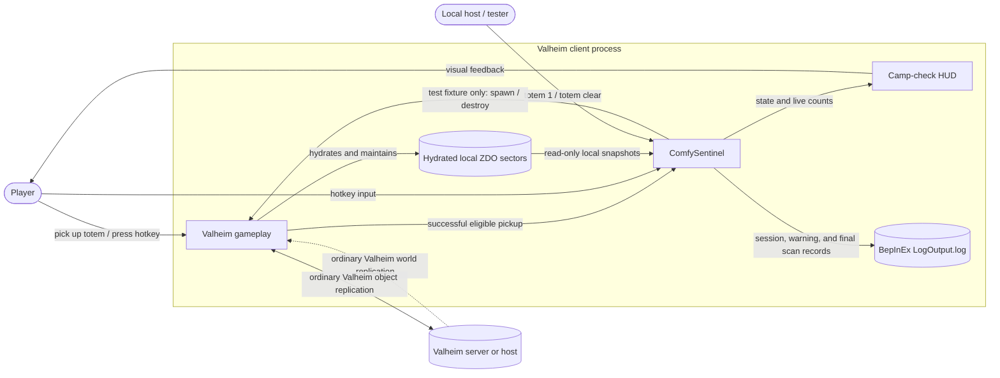
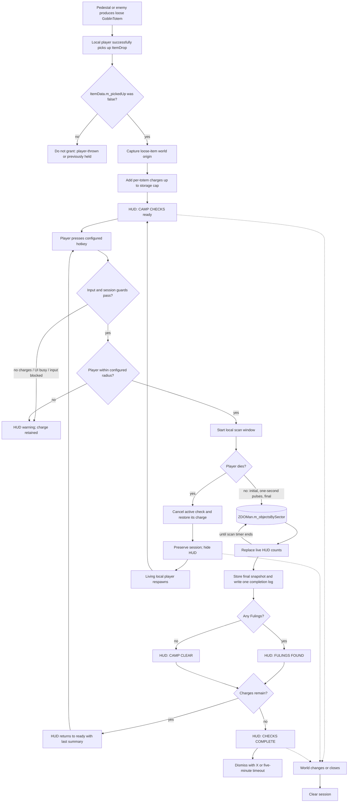
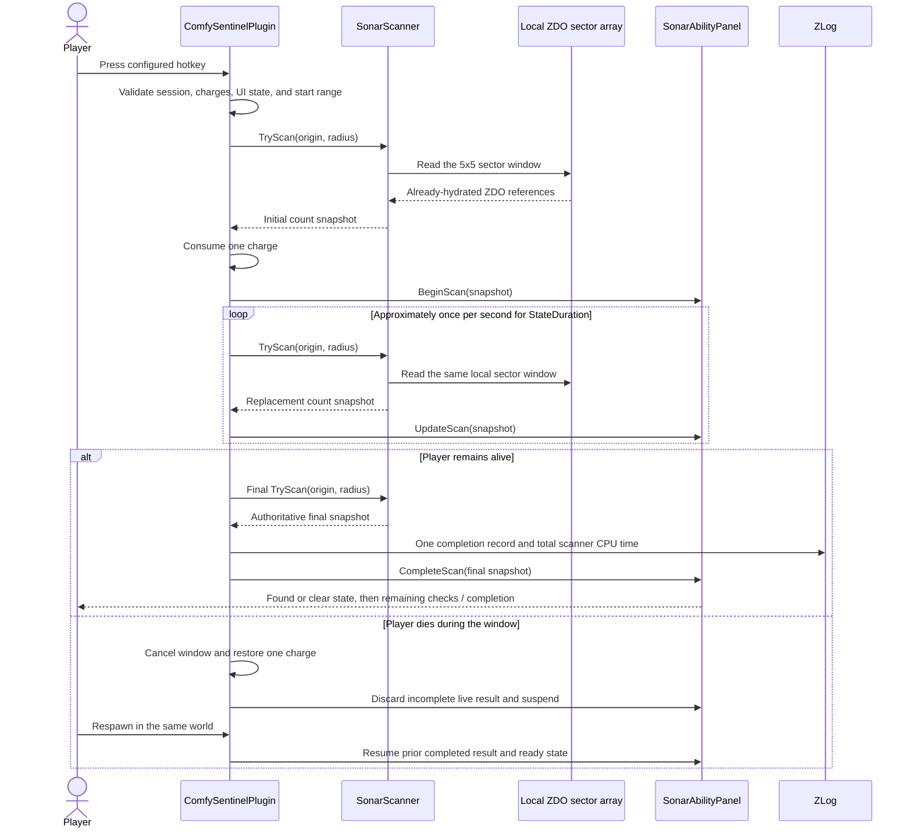

# ComfySentinel data-flow diagrams

This document describes ComfySentinel 1.5.0 as implemented. The normal sonar path is entirely inside the Valheim client: it reads the ZDOs that Valheim has already hydrated and does not request data from the server.

## System context

The dotted server-to-client flow is owned by Valheim. ComfySentinel does not initiate it, force a sector to load, claim ZDO ownership, or send a sonar RPC.

## Level 1: normal gameplay flow

## Level 2: one camp check

One charge is consumed after the initial snapshot succeeds. Intermediate values are replacements, not a cumulative total. If local ZDO access fails before the first snapshot, no charge is consumed. If it fails after the window starts, the already-consumed charge is not restored. Death during the window is a deliberate exception: the incomplete check is cancelled and its charge is refunded.

## Data stores and payloads

| Store or payload | Owner | Access | Contents |
| --- | --- | --- | --- |
| Hydrated ZDO sector array | Valheim | ComfySentinel reads only | Active client-known world objects indexed by sector |
| Loose totem provenance | Valheim item/ZDO data | ComfySentinel reads only | `m_pickedUp` distinguishes a first world pickup from a re-dropped inventory item |
| Sonar session state | ComfySentinel process memory | Read/write, client only | World UID, origin, stacked charges, death suspension, scan timers, pulse count, CPU ticks |
| Current scan result | ComfySentinel process memory | Read/write, client only | Standard Fulings, Shamans, Brutes, Coins, Black Metal |
| Generated config | BepInEx | Read at runtime | Charge, radius, key, and UI-duration settings |
| `LogOutput.log` | BepInEx | Append through `ZLog` | Initialization, session, rejection, final result, and errors |
| Test fixture object list | ComfySentinel process memory | Read/write during test commands | References to the seven spawned fixture objects |

## Network trust boundary

Normal sonar checks do not cross the network boundary. They do not:

- invoke an RPC;
- create, mutate, or destroy a ZDO;
- ask Valheim to load a sector;
- claim network ownership;
- use a server query or remote administrative API.

The `totem 1` and `totem clear` test commands are the explicit exception. On a local or client-hosted world they create or destroy ordinary Valheim network objects, so Valheim may replicate those fixture changes to connected players.
