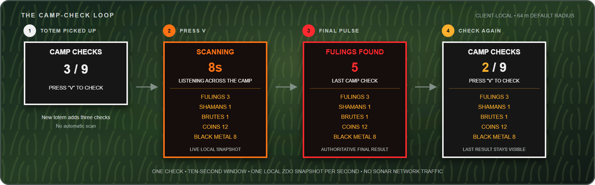
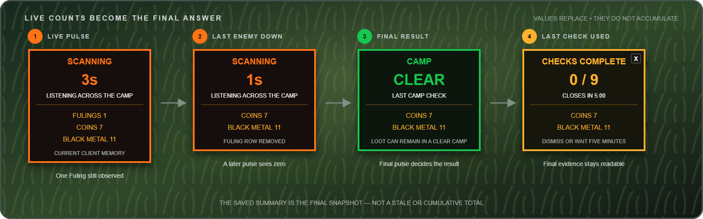

# Product documentation

## Product summary

ComfySentinel turns the first successful pickup of a newly discovered Fuling Totem into a limited, player-controlled camp-check ability. It helps players decide whether a Fuling village is actually clear and whether loose high-value loot remains, without relying on an opaque administrative script or interrupting active combat.

The player chooses when to scan. Picking up a totem arms the ability but does not scan immediately.

## Problem statement

Fuling villages are difficult to inspect during darkness, rain, fog, or an active fight. A missed Fuling can make a camp look clear, while a server rule or background monitor may still treat the village as uncleared. Players also lose loose coins and black metal in the terrain.

ComfySentinel makes the check visible, limited, and predictable:

- each eligible first pickup clearly adds a fixed number of checks, up to a visible cap;
- the player spends a check only when ready;
- a short scan window shows changing local counts;
- the final result remains readable after the transition;
- normal scanning adds no mod-generated server traffic.

## Intended users

| User | Need |
| --- | --- |
| Player clearing a Fuling village | Confirm that no local Fuling ZDOs remain before leaving or looting the totem area |
| Player collecting loot | Find the remaining loose coin and black-metal stack totals near the current totem origin |
| Private-world host | Test the complete pickup, combat, loot, scan, and UI flow safely |
| Mod maintainer | Diagnose results from concise logs without running a server-side component |

## Product goals

- Preserve player agency: a totem grants checks; it does not force an immediate check.
- Preserve earned checks through death and refund a check interrupted by death.
- Allow checks from multiple new totems to stack to a configurable cap.
- Reject previously picked-up, player-thrown totems while accepting new pedestal and enemy-drop items.
- Stay readable in combat: use a compact card beneath the minimap, not center-screen messages.
- Make state changes predictable: ready, scanning, result, ready/complete.
- Report useful categories separately: standard Fulings, Shamans, Brutes, Coins, and Black Metal.
- Keep scans private and network-friendly by using local, already-hydrated ZDO state.
- Keep the scanner hot path bounded and allocation-free.
- Fail visibly and safely if Valheim's internal sector representation is incompatible.

## Non-goals

ComfySentinel is not intended to:

- certify server-authoritative village completion;
- discover objects in unloaded or non-hydrated sectors;
- reveal loot inside containers or player inventories;
- count every Plains creature or every loot prefab;
- navigate the player to individual targets;
- replace server rules, enforcement, or audit logs;
- run a continuous background radar before a totem is picked up;
- carry checks into a different world or server;
- grant checks again when an inventory totem is dropped and repicked.

## Player journey

1. The player successfully picks up a `GoblinTotem` that Valheim has not marked as previously picked up.
2. The card appears beneath the minimap and adds the per-totem grant without exceeding the storage cap.
3. The player can continue fighting, kiting, or collecting loot without an automatic scan.
4. When ready, the player returns within the configured radius of the newest eligible totem pickup position and presses the configured key.
5. One charge is consumed after the initial local snapshot succeeds.
6. During the default 10-second window, the card refreshes observed enemy and loot counts approximately once per second.
7. The final snapshot becomes either `FULINGS FOUND` or `CAMP CLEAR`.
8. After the result duration, the card returns to the ready state with the last snapshot in gold text, or enters `CHECKS COMPLETE` after the last charge.
9. A completed card can be dismissed with `X` and otherwise closes after the default five-minute timer.

Picking up another eligible totem adds another grant, up to nine checks by default. The scan origin moves to the newest eligible pickup and the prior camp summary is cleared so results from two origins are not mixed.

If the player dies, banked checks remain associated with the current world. An active check is cancelled, its spent charge is restored, and the card resumes after respawn. The card is hidden while the player is dead. Leaving the world clears the session.

## UI state model

| State | Accent | Primary information | Exit condition |
| --- | --- | --- | --- |
| Hidden | None | Nothing | A totem arms a session or preview is enabled |
| Ready | White | Remaining checks and hotkey | Player starts a valid scan |
| Scanning | Orange | Countdown plus live replacement summary | Scan window ends or local scan access fails |
| Found | Red | Final total Fulings and category summary | `StateDuration` elapses |
| Clear | Green | `CAMP CLEAR` and loot summary, if any | `StateDuration` elapses |
| Complete | Gold | No checks remain, final summary, close control | Player presses `X` or timer expires |
| Out of range | Orange | Required radius and return instruction | `StateDuration` elapses |
| Depleted | Orange | No checks remain | `StateDuration` elapses |
| Unavailable | Orange | Scan failure and log instruction | `StateDuration` elapses |

The live and saved summaries only display nonzero rows. If every tracked category is zero, the summary reads `NOTHING DETECTED`.

## Detection contract

One snapshot reports matching local ZDOs whose positions fall inside a circle centered on the newest eligible totem pickup position.

| UI row | Valheim prefab | Count semantics |
| --- | --- | --- |
| Fulings | `Goblin` | One per matching ZDO |
| Shamans | `GoblinShaman` | One per matching ZDO |
| Brutes | `GoblinBrute` | One per matching ZDO |
| Coins | `Coins` | Sum of each loose item's ZDO stack value |
| Black Metal | `BlackMetalScrap` | Sum of each loose item's ZDO stack value |

`FULINGS FOUND` is selected when the combined standard Fuling, Shaman, and Brute count is greater than zero. Loot does not make a camp hostile: a scan with no Fulings and some loose loot still displays `CAMP CLEAR`, with the loot rows underneath.

The final snapshot is authoritative for the card and completion log. Earlier pulse values are not accumulated. Once Valheim removes a killed enemy or collected item from the client's hydrated sector table, a later pulse can reduce or clear that row.

## Functional rules

### Arming

- Only a successful `Humanoid.Pickup` by `Player.m_localPlayer` can grant checks.
- The loose item's drop prefab must have the stable hash of `GoblinTotem`.
- Valheim's `ItemData.m_pickedUp` flag must still be false before the pickup. Pedestal-spawned and enemy-dropped totems qualify; inventory items re-dropped by a player do not.
- The loose totem's position is captured before Valheim destroys the world object.
- Each qualifying item in the loose stack grants `MaxSonarCharges`, capped by `MaxStoredSonarCharges`.
- The newest eligible pickup becomes the fixed scan origin and displays Ready.

### Starting a check

- A session must be active.
- At least one charge must remain.
- The console and text-input UI must be closed.
- The result/warning UI must have returned to a startable state.
- The player must be within `ScanRadius` of the saved origin when the check begins.
- The first local snapshot must succeed before a charge is consumed.

The start-range test is not repeated during the scan window. Every pulse remains centered on the saved totem origin, even if the player moves after starting the check.

### Completing a check

- Live values refresh on a fixed one-second pulse interval.
- `StateDuration` determines how long the active scan window lasts.
- A final snapshot is taken when that window ends.
- One completion log records the final values, remaining charges, exact pulse count, and cumulative scanner CPU time.
- The local wishbone effect is attempted once at check start and is skipped if its prefab contains a `ZNetView`.

### Death and respawn

- Banked checks, the latest completed result, and the origin remain in client memory during death.
- If a check is Scanning, it is cancelled immediately and its one spent charge is restored.
- The incomplete live snapshot is discarded in favor of the last completed result.
- The card is suspended until a living local player exists again.
- The final-summary timeout is paused during suspension.
- Changing worlds or returning to the main menu clears the session.

### Failure behavior

- Out of range: retain the charge, show a temporary warning, and log the distance.
- Initial local snapshot unavailable: retain the charge and show `SCAN FAILED`.
- Later pulse unavailable: stop the scan, discard the incomplete live snapshot, retain the already-spent charge, and show `SCAN FAILED` with the prior completed summary.
- No charges: show `NO CHECKS`; the prior result remains available if one exists.
- Startup sector-binding failure: log the compatibility error and do not install gameplay patches.

## Configuration

| Setting | Default | Allowed range | Product effect |
| --- | ---: | ---: | --- |
| `MaxSonarCharges` | `3` | `1` to `int.MaxValue` | Checks granted by each totem |
| `MaxStoredSonarCharges` | `9` | `1` to `int.MaxValue` | Maximum banked checks across eligible totems |
| `ScanRadius` | `64` m | `1` to `128` m | Circular result filter and check-start range |
| `PingHotkey` | `V` | Unity `KeyCode` | Key that starts a check |
| `StateDuration` | `10` s | `1` to `60` s | Active scan window and result/warning display time |
| `FinalSummaryDuration` | `300` s | `30` to `1800` s | Completed-card automatic timeout |

The generated file is `BepInEx/config/comfy.mods.comfysentinel.cfg`. Restart Valheim after changing it so the new runtime values are applied consistently.

## Network and privacy promise

The normal sonar feature has no ComfySentinel network request or server component. It reads the sector array that already exists in the client process. This means:

- the server receives no sonar query;
- other players do not receive a sonar event;
- the scan cannot see server state that the client has not hydrated;
- installing the mod does not make its result server-authoritative.

The base game may still send its ordinary traffic for player movement, item pickup, combat, and world replication. The host-only test fixture intentionally creates ordinary networked Valheim objects and is outside the normal-sonar promise.

## Acceptance criteria

A release is behaviorally complete when:

- picking up a valid local Fuling Totem shows the ready card without scanning;
- picking up two eligible default totems banks six checks and three bank nine;
- repicking a player-thrown totem grants no checks;
- an enemy-dropped, never-picked-up totem grants checks;
- an out-of-range key press preserves the charge;
- a valid key press consumes exactly one charge;
- changing local enemy or loot state can appear on a later pulse during the window;
- the final UI uses the last snapshot and clears rows that reached zero;
- death preserves the session, and death during Scanning restores the interrupted charge;
- using all banked checks ends in the dismissible five-minute summary;
- ordinary scanning emits no RPC or ZDO mutation;
- the Release configuration builds without warnings or errors against the supported stack.
