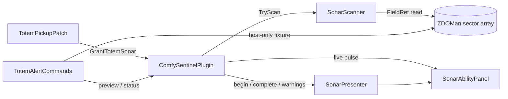

# Technical deep dive

This document explains the internal design of ComfySentinel 1.5.0 for maintainers and reviewers. It complements the [data-flow diagrams](data-flow-diagram.md) and [technical stack](tech-stack.md).

## Architecture

The plugin intentionally keeps the production flow synchronous on Unity's main thread. A snapshot is a bounded in-memory loop and does not justify a worker thread, synchronization layer, or marshaling Unity state across threads.

## Startup and compatibility gate

`ComfySentinelPlugin.Awake()` performs four stages:

1. Bind the six BepInEx configuration entries.
2. Call `SonarScanner.Initialize()`.
3. Patch the assembly through Harmony.
4. Register the console commands and log the active defaults.

Scanner initialization creates cached Harmony `FieldRef` delegates for three private `ZDOMan` fields:

- `m_objectsBySector` as `List<ZDO>[]`;
- `m_width` as `int`;
- `m_halfWidth` as `int`.

This is the only reflective binding used by the scanner. It happens once, before the gameplay patch is installed. If any field cannot be bound, the plugin logs a compatibility error and returns from `Awake()` without patching `Humanoid.Pickup`. That fail-closed behavior prevents a half-working UI from promising scan results it cannot produce.

Harmony patch installation and console command registration share a `try` block. `_patchesApplied` is set only after both complete. `OnDestroy()` clears any tracked test fixture, resets the in-memory sonar session, and unpatches the plugin.

## Totem pickup hook and provenance

`TotemPickupPatch` targets `Humanoid.Pickup(GameObject, bool, bool)`. Using the actual inventory-pickup method handles both pedestal-produced loose items and direct enemy drops while providing a real success result in `__result`.

The Prefix calls `ItemDrop.Load()` and captures a small `PickupState` before Valheim destroys the loose object. It requires:

- the humanoid is `Player.m_localPlayer`;
- the object has an `ItemDrop`;
- the item is a Fuling Totem, identified internally by Valheim's legacy `GoblinTotem` prefab ID;
- `ItemData.m_pickedUp` is false;
- the loose stack count is positive after clamping.

Valheim changes `m_pickedUp` to true when an item first enters a player inventory and serializes that value when the item is dropped again. That existing provenance bit is the anti-sharing guard: a pedestal or enemy creates a never-picked-up item, while a totem thrown from any player's inventory remains marked as previously picked up.

The Postfix grants checks only when the Prefix was eligible and `Humanoid.Pickup` returned true. It passes the loose item's world position and stack count to `GrantTotemSonar()`.

Granting sonar:

- cancels an active pulse window and restores its spent charge;
- adds `MaxSonarCharges * looseStackCount` to the current bank;
- clamps the result to `MaxStoredSonarCharges`, nine by default;
- replaces `LastScanOrigin` with the newest eligible pickup position;
- records the current Valheim world UID;
- marks the session active and clears the old camp summary;
- logs requested totems, actual added charges, cap, origin, radius, and key.

An eligible pickup at the cap still updates the origin but adds zero charges. Sonar state remains process memory only: it survives the same-world death/respawn lifecycle but is cleared when `ZNet` disappears, the world UID changes, or the plugin unloads.

## Frame loop and input gating

`ComfySentinelPlugin.Update()` first validates world and player lifecycle, then has two input modes.

### World and death lifecycle

If an active session's saved world UID differs from `ZNet.GetWorldUID()`, the session is cleared. If `ZNet.instance` disappears, returning to the main menu also clears it.

When the local player is dead or temporarily absent while the world still exists, the plugin suspends rather than resets the session. A running check is cancelled and refunded once, the incomplete live UI snapshot is rolled back, and the panel is hidden. A later living local player resumes Ready or Complete with the last completed result. The final-summary timeout is shifted by the suspension duration so death does not consume its display time.

### Active scan mode

When `_scanInProgress` is true, `UpdateActiveScan()` owns the frame. Additional hotkey presses are ignored until the scan window completes or aborts.

### Ready input mode

Outside an active scan, the plugin requires all of the following:

- a local player;
- an active session;
- the console is not visible;
- a Valheim text-input field is not visible;
- the configured key went down on this frame;
- at least one charge remains;
- `SonarAbilityPanel.CanBeginScan` is true;
- the player's squared distance from `LastScanOrigin` does not exceed `ScanRadius * ScanRadius`.

The squared-distance comparison avoids a square root on the accepted path. A rejected out-of-range attempt computes the square root only to produce a readable log value. Rejections do not spend a charge.

`CanBeginScan` accepts only Ready or Hidden. Consequently, result and warning states deliberately debounce the action until their configured state duration expires.

## Pulse-window lifecycle

The pulse interval is a fixed one second. `StateDuration`, defaulting to ten seconds, controls the wall-clock length of the scan window.

### Start

`StartActiveScan()` performs an immediate `TryScan()` before changing state. If that snapshot fails, the UI reports failure and no charge is consumed.

After a successful initial snapshot:

1. decrement `ActiveSonarCharges` once;
2. capture `Time.unscaledTime` as the window start;
3. schedule the next pulse for one second later;
4. initialize cumulative `Stopwatch` ticks and pulse count;
5. play the guarded effect once;
6. enter the Scanning UI with the initial counts.

### Live pulses

While elapsed unscaled time is less than `StateDuration`, `UpdateActiveScan()` returns quickly on frames before `_nextScanPulseAt`. When due, it takes one snapshot, adds its CPU ticks, increments the pulse count, schedules the next pulse relative to the current frame, and replaces the panel's result.

Scheduling relative to the current frame prevents a slow frame from causing a burst of catch-up scans. It also means the exact pulse count can vary slightly with frame timing.

### Final snapshot

At the end of the window, the plugin always attempts another snapshot instead of treating the last intermediate value as final. That final result:

- determines Found versus Clear;
- becomes the saved gold summary;
- clears categories that have fallen to zero;
- is written to the single completion log;
- starts the five-minute final-summary timer if the last charge was used.

With smooth frame timing and the default duration, a check commonly contains 11 snapshots: one initial, nine intermediate snapshots near seconds 1 through 9, and one final snapshot near second 10. The `pulses` log field is the authoritative count.

If an intermediate or final snapshot fails, the active window aborts, rolls back to the pre-scan result, and displays Unavailable. The charge remains spent because the check and its initial snapshot already occurred.

Death is handled differently from a scanner failure. The active window is cancelled, the saved pre-scan result is restored, and the spent charge is refunded before the session is suspended for respawn.

## Spatial scanner

`SonarScanner.TryScan()` returns a value-type `ScanResult` containing five integers. `Fulings` is a computed sum of standard Fulings, Shamans, and Brutes.

### Cached prefab identities

Stable hashes are cached in static fields for the following Fuling categories. Valheim's literal legacy prefab IDs are shown in parentheses because the scanner must match them exactly:

- standard Fuling (`Goblin`);
- Fuling Shaman (`GoblinShaman`);
- Fuling Brute (`GoblinBrute`);
- `Coins`;
- `BlackMetalScrap`.

The string-to-hash work happens when the scanner type initializes, not inside a scan or object loop. Each scanned ZDO is compared using its integer prefab hash.

### Sector mapping

The scan origin is converted to Valheim's sector coordinate with `ZoneSystem.GetZone(centerPoint)`. The scanner then visits the 5-by-5 window from `centerSector - 2` through `centerSector + 2` on both axes.

For each sector coordinate:

1. add `m_halfWidth` to obtain the sector-array coordinate;
2. reject out-of-bounds coordinates using unsigned comparisons;
3. calculate the row offset once per Y coordinate;
4. read the sector's `List<ZDO>` directly from `m_objectsBySector`.

The fixed 5-by-5 candidate window covers the supported scan-radius range without enumerating a dictionary or querying Unity physics. The exact circular boundary is enforced later, so visiting a square candidate window does not create square-shaped results.

### Object filter order

The innermost indexed `for` loop applies inexpensive filters before more detailed reads:

1. skip null ZDO references;
2. read the integer prefab hash;
3. skip all five-category nonmatches;
4. calculate squared distance from the saved origin;
5. skip objects beyond `radius * radius`;
6. increment an enemy count or read and add a loot stack.

Loose loot uses `ZDO.GetInt(ZDOVars.s_stack, 1)`. A nonpositive stack is conservatively counted as one. Enemies count one matching ZDO each; the scanner does not query their components, AI, health, or physics colliders.

A destroyed enemy may remain visible until Valheim removes or updates its ZDO in the client's hydrated table. A later pulse reflects the table as it exists at that moment.

### Complexity

Let `N` be the total number of ZDO references in the 25 candidate sectors.

- Time: `O(N)` per snapshot.
- Additional scanner space: `O(1)`.
- Sector count: fixed at 25 before world-edge bounds checks.
- Distance calculation: squared magnitude, no square root.

The scan does not scale with every ZDO in the world, only the currently indexed objects in the fixed local sector window.

## Allocation and CPU behavior

The allocation-free claim is intentionally scoped to the scanner's hot spatial loop:

- `ScanResult` is a readonly value type;
- cached `FieldRef` delegates are reused;
- sector and object collections are indexed with traditional `for` loops;
- there is no LINQ, iterator, boxing, per-scan reflection, or temporary collection;
- all counters and math values are stack/value types.

The surrounding system is not claimed to allocate nothing. Unity IMGUI formats and draws strings every visible frame, logs allocate formatted messages at state transitions, and the one-time scan-start effect may instantiate a local Unity object. These operations are outside the ZDO scanner loop.

Each snapshot is timed with `Stopwatch.GetTimestamp()`. Only the completed check logs the accumulated scanner CPU time, preventing one log allocation and disk write per live pulse.

## Network behavior

### Normal sonar path

The production path calls no RPC and performs no ZDO write. It does not call object-spawn, ownership, sector-load, or server-query APIs. Reads come from `ZDOMan.instance` inside the client process.

The result is therefore:

- local, not server-authoritative;
- limited to state Valheim has already hydrated;
- invisible to other players as a mod event;
- unable to block waiting for a sonar network response.

Ordinary Valheim activity still behaves normally. Picking up an item, moving, fighting, and receiving replicated world changes may produce base-game network traffic independently of ComfySentinel.

The pickup provenance guard reads Valheim's existing `m_pickedUp` value. ComfySentinel does not write an anti-sharing tag or send a provenance message.

### Wishbone effect guard

At the beginning of a check, `SonarPresenter` obtains `vfx_WishbonePing` from the local `ZNetScene` prefab registry. Before instantiation it searches the prefab hierarchy for a `ZNetView`.

- No `ZNetView`: instantiate the effect locally once.
- `ZNetView` present: skip the effect and log a warning.
- Prefab or scene unavailable: omit the effect but continue the UI scan.

This guard favors the network promise over audiovisual feedback if a Valheim update changes the prefab's composition.

### Test harness exception

`totem 1` is registered as a network console command and first requires `ZNet.instance.IsServer()`. It creates seven tracked objects:

1. an item stand;
2. an invisible pickable interaction proxy configured to yield a Fuling Totem;
3. a standard Fuling;
4. a Fuling Shaman;
5. a Fuling Brute;
6. a 12-coin loose stack;
7. an 8-piece black-metal loose stack.

The item stand visual uses a ZDO write and `SetVisualItem` RPC. Spawned objects are marked nonpersistent but are still ordinary networked Valheim objects while alive. `totem clear` destroys objects still referenced in the local tracking list. This code is deliberately isolated in `TotemAlertCommands` and is not reachable from normal totem pickup or sonar input.

Interacting with the fixture's pickable proxy makes Valheim produce a normal, never-picked-up Fuling Totem ItemDrop (internal prefab ID `GoblinTotem`). Checks are granted only when that loose item successfully enters the local inventory, which exercises the same provenance patch as a real pedestal or enemy drop.

## HUD design

`SonarAbilityPanel` is a static IMGUI state machine drawn from the plugin's `OnGUI()` method.

### Position and scale

The card scale is based on `Screen.height / 1080`, clamped between 0.80 and 1.45. If the small minimap is active, the code reads its four world corners and aligns the card beneath its lower-right area. Otherwise it uses an upper-right fallback. Final coordinates are clamped to the screen.

The card grows vertically based on the number of nonzero summary rows. Styles are created lazily and reused.

### State timing

All UI timers use `Time.unscaledTime`:

- Scanning lasts `StateDuration` and is completed by the plugin's final pulse.
- Found, Clear, OutOfRange, Unavailable, and Depleted transition after `StateDuration`.
- Complete remains until `FinalSummaryDuration` or an `X` click.

The saved summary is visible during Scanning, Ready, Found, Clear, Complete, and Depleted. `UpdateScan()` overwrites the full result struct; therefore a row disappears as soon as a later snapshot reports zero.

## Logs and observability

The plugin logs:

- successful initialization and active settings;
- a newly armed session and its origin;
- stacked totem grants, storage cap, death suspension, charge restoration, and respawn;
- out-of-range, no-charge, and temporarily busy attempts;
- local-sector access failures;
- one final line per completed check;
- preview/test fixture operations and cleanup;
- final-summary dismissal or timeout.

The final line includes origin, current player distance, radius, each category, combined Fulings, remaining charges, exact pulse count, accumulated scanner CPU milliseconds, and `source=local-zdo`.

The current player distance is diagnostic only. Because the start-range guard is not repeated during the window, it can exceed the configured radius in the final log while the fixed-origin scan still completes.

## Failure containment

| Failure | Containment behavior |
| --- | --- |
| Private ZDO fields changed | Do not patch gameplay; log startup error |
| `ZDOMan` or `ZoneSystem` absent at snapshot | Return failure without dereferencing |
| Sector array dimensions inconsistent | Return failure |
| Scan-start effect missing | Log warning; continue scan |
| Effect became networked | Skip effect; continue scan |
| Player dies during a check | Cancel check, restore charge and prior completed result, suspend HUD |
| Player respawns in same world | Resume banked checks and paused final-summary timer |
| World UID changes or `ZNet` closes | Clear the in-memory session |
| Fixture prefab missing | Stop fixture creation, clean tracked objects, report error |
| Plugin unload | Clear fixture, reset session, unpatch Harmony |

## Safe extension points

### Add a detected prefab

1. Add one cached stable hash.
2. Extend `ScanResult` with an integer field.
3. Add the hash to the first-match filter.
4. Count it after the radius check.
5. Add a UI summary row and log field.
6. Update product and data-flow documentation.

Avoid strings, component lookups, Unity object searches, or collection creation inside the ZDO loop.

### Make the pulse interval configurable

The current interval is deliberately fixed at one second. If exposed later, enforce a safe lower bound and retain replacement semantics. Evaluate both scanner CPU and IMGUI readability before allowing sub-second values.

### Add another fixture

Keep all object creation inside the host-only command path, mark fixtures nonpersistent, add every created object to `SpawnedTestObjects`, and ensure partial failures call `ClearTestScenario()`.

## Maintainer validation checklist

Before releasing a change:

1. Build Release with zero warnings and errors.
2. Verify normal scanner code contains no RPC, ZDO mutation, forced loading, LINQ, physics query, or per-scan reflection.
3. Pick up a real or fixture totem and confirm 3/9 checks with no immediate scan.
4. Pick up two more eligible totems and confirm charges cap at 9/9.
5. Drop and repick an inventory totem and confirm it grants nothing.
6. Verify an unpicked enemy-drop totem grants checks.
7. Verify out-of-range input retains its charge.
8. Kill and collect objects during the scan window; confirm live rows and the final snapshot decrease.
9. Confirm a clean final pulse removes stale enemy and loot rows.
10. Die with banked checks and verify they return after respawn.
11. Die during Scanning and verify the check is cancelled, its charge is restored, and the prior result returns.
12. Use all charges and verify the `X` plus final timeout.
13. Review `LogOutput.log` for one completion record per check and plausible pulse/CPU values.
14. Test `totem 1` rejection from a non-host client.
15. Test world change, world unload, and plugin shutdown with no session carried across worlds.
